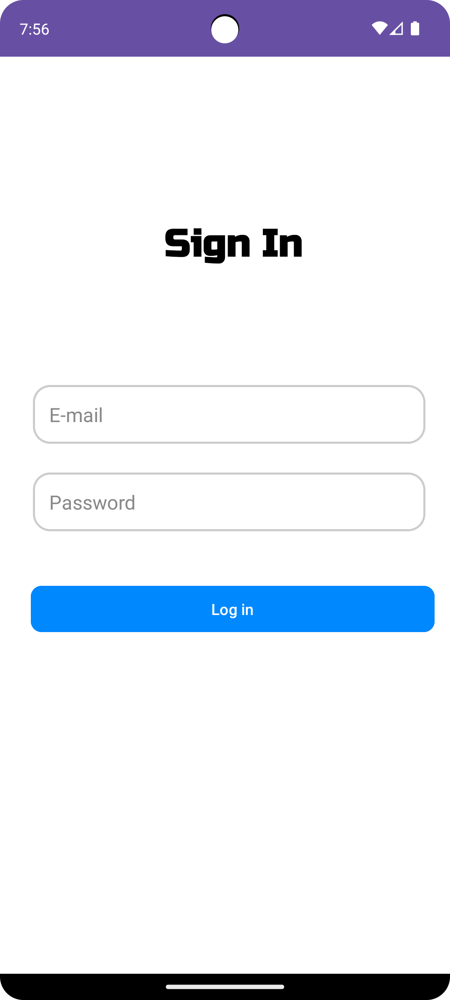
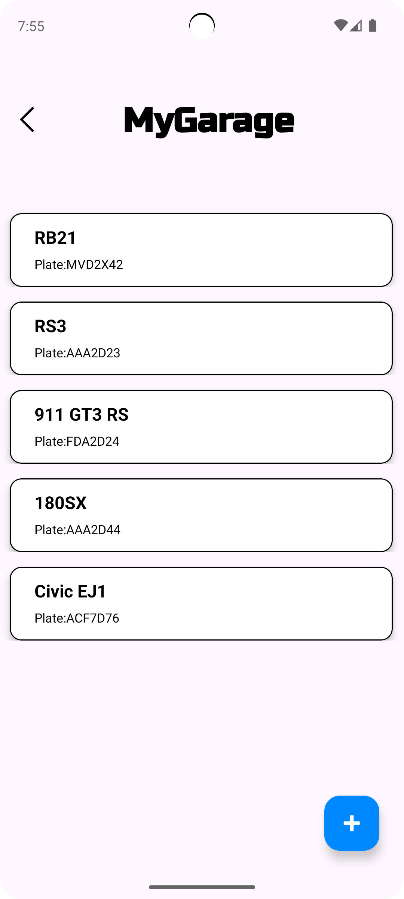
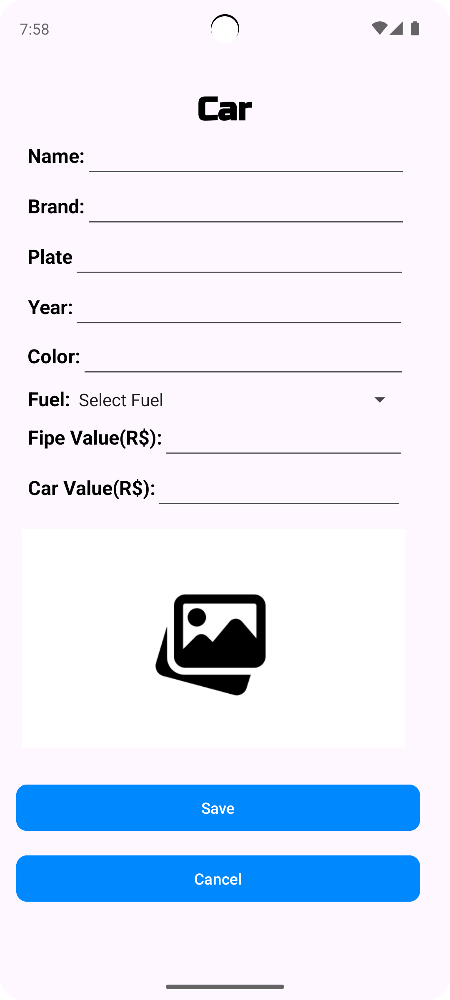

# My Garage - Android App

### Description

- App responsible for storing information about a collection of miniatures or cars.

### Developer

- Gustavo Alfredo Correa Da Silva

### Course information

- University: PUC Paraná - Curitiba
- Postgraduate Course: Mobile Application Development
- Course: Android Application Development

> 🔨 Project Functions:

    - Create: Add a New Car/Miniature.
    - Read All: View All Registered Cars/Miniatures.
    - Read One: View a Single Car/Miniature.
    - Update: Update a Car/Miniature.
    - Delete: Delete a Single Car/Miniature.

> 🔨 Technical Information:

    - Programming Language: Kotlin Android.
    - Storage: Local (Device).
    - Design Pattern: MVC (Model, View, Controller).

### Tools

IDEA: [Android Studio](https://developer.android.com/studio?hl=pt-br) &nbsp;&middot;&nbsp;  
Screen Prototyping: [Figma](https://www.figma.com/pt-br/) &nbsp;&middot;&nbsp;  

### 📷 Screens

 
 